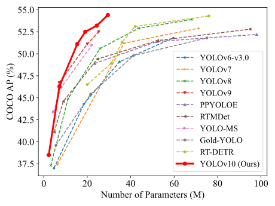

# train-yolo-model

## About

Ultralyticsライブラリを用いたYOLOのファインチューニングを行うためのリポジトリ

## Model Information

<details>
<summary>YOLOv10</summary>

※ [THU-MIG/yolov10](https://github.com/THU-MIG/yolov10) から引用


<p align="center">
  
   <br>
  Comparisons with others in terms of latency-accuracy (left) and size-accuracy (right) trade-offs.
</p>

[YOLOv10: Real-Time End-to-End Object Detection](https://arxiv.org/abs/2405.14458).\
Ao Wang, Hui Chen, Lihao Liu, Kai Chen, Zijia Lin, Jungong Han, and Guiguang Ding

## Performance
COCO

| Model | Test Size | #Params | FLOPs | AP<sup>val</sup> | Latency |
|:---------------|:----:|:---:|:--:|:--:|:--:|
| [YOLOv10-N](https://huggingface.co/jameslahm/yolov10n) |   640  |     2.3M    |   6.7G   |     38.5%     | 1.84ms |
| [YOLOv10-S](https://huggingface.co/jameslahm/yolov10s) |   640  |     7.2M    |   21.6G  |     46.3%     | 2.49ms |
| [YOLOv10-M](https://huggingface.co/jameslahm/yolov10m) |   640  |     15.4M   |   59.1G  |     51.1%     | 4.74ms |
| [YOLOv10-B](https://huggingface.co/jameslahm/yolov10b) |   640  |     19.1M   |  92.0G |     52.5%     | 5.74ms |
| [YOLOv10-L](https://huggingface.co/jameslahm/yolov10l) |   640  |     24.4M   |  120.3G   |     53.2%     | 7.28ms |
| [YOLOv10-X](https://huggingface.co/jameslahm/yolov10x) |   640  |     29.5M    |   160.4G   |     54.4%     | 10.70ms |


</details>


## Setup

### 1. リポジトリをクローン

```bash
git clone git@github.com:TechC-SugarCane/train-yolo-model.git
cd train-yolo-model
```

### 2. Pythonの環境構築

```bash
uv python install
```

### 3. ライブラリのインストール

```bash
uv sync
```

### 4. デフォルトセッティングを変更

```bash
# datasetsのディレクトリを../manage-dataset/に変更
# デフォルトだと../datasetsが設定されている
uv run yolo settings datasets_dir=../manage-dataset/
```

### 5. 事前学習済みモデルのダウンロード

[`./utils/download_yolo_weights.ps1`](utils/download_yolo_weights.ps1)を使うと、[`./weights/weights_map.json`](weights/weights_map.json)に記載されているモデルの重みがダウンロードできます。

```ps1
# (例1) YOLOv10の全ての重みをダウンロード
./utils/download_yolo_weights.ps1 -v "yolov10"
# (例2) YOLOv10のsの重みをダウンロード
./utils/download_yolo_weights.ps1 -v "yolov10" -w s
# (例3) YOLOv10のs,m,lの重みをダウンロード
./utils/download_yolo_weights.ps1 -v "yolov10" -w s,m,l
# (例4) YOLOv11の全ての重みを強制的にダウンロード
./utils/download_yolo_weights.ps1 -v "yolov11" -f
```

### 6. データセットのダウンロード

データセットは 一階層上に[manage-datasetリポジトリ](https://github.com/TechC-SugarCane/manage-dataset)をcloneし、[manage-dataset/README](https://github.com/TechC-SugarCane/manage-dataset/blob/main/README.md)に従ってダウンロードしてください。

```shell
# clone済みの人はスキップ
cd ..
git clone git@github.com:TechC-SugarCane/manage-dataset.git
# その後、READMEに従ってデータセットをダウンロード
```


## Training

<details>
<summary>YOLOv10</summary>

```bash
# サトウキビをファインチューニングするコマンド
uv run yolo detect train cfg='cfg/yolov10/sugarcane.yaml' data=data/sugarcane.yaml model=weights/yolov10/yolov10x.pt name='yolov10x-sugarcane' epochs=300 batch=16 imgsz=640 device=0

# パイナップルをファインチューニングするコマンド
uv run yolo detect train cfg='cfg/yolov10/pineapple.yaml' data=data/pineapple.yaml model=weights/yolov10/yolov10x.pt name='yolov10x-pineapple' epochs=300 batch=16 imgsz=640 device=0
```

※ 上記を実行すると`yolov8n.pt`,`yolo11n.pt`がダウンロードされますが、AMPというものの確認用に追加されているだけらしいので気にしなくて大丈夫です。
詳しくは[#106](https://github.com/THU-MIG/yolov10/issues/106)を参照してください。
</details>

<br>

学習後の結果は`runs/detect/<name(番号)>`に保存されます。

また、ハイパーパラメーターは自由に調整してください。下記ファイルが`cfg/<yolo_version>`にあります。このファイルの`Hyperparameters`の部分でハイパラ関連の設定ができます。

- サトウキビ: `sugarcane.yaml`
- パイナップル: `pineapple.yaml`

## logging

学習のログは`runs/detect/<name(番号)>`に保存されます。
ログを確認する際は、tensorboardを使ってください。

```bash
uv run tensorboard --logdir ./runs/detect/<name(番号)>
```

### 使用例

[](./assets/ex_tensorboard.png)

## Export

モデルをONNXにエクスポートする際は、下記のコマンドを実行してください。

```sh
# End-to-End ONNX
# <name(番号)>は、学習後の結果のディレクトリ名を指定してください
uv run yolo export model="runs/detect/<name(番号)>/weights/best.pt" format=onnx opset=13 simplify device=0
```

## コントリビューター向けガイドライン

コントリビューター向けのガイドラインについては、こちらの[CONTRIBUTING.md](https://github.com/TechC-SugarCane/.github/blob/main/CONTRIBUTING.md)を参照してください。

### PRを出す時

Pythonファイルが含まれた実装PRは[lintのCI](./.github/workflows/lint.yml)が走るようになっています。

PRを出す前に、下記コマンドでlintを実行し、エラーが出たら修正してください。

#### linter

```bash
# lint
uv run ruff check
# lintの修正コマンド
uv run ruff check --fix
```

#### formatter

```bash
uv run ruff format
```

#### type check

```bash
uv run mypy --ignore-missing-imports --explicit-package-bases .
```
